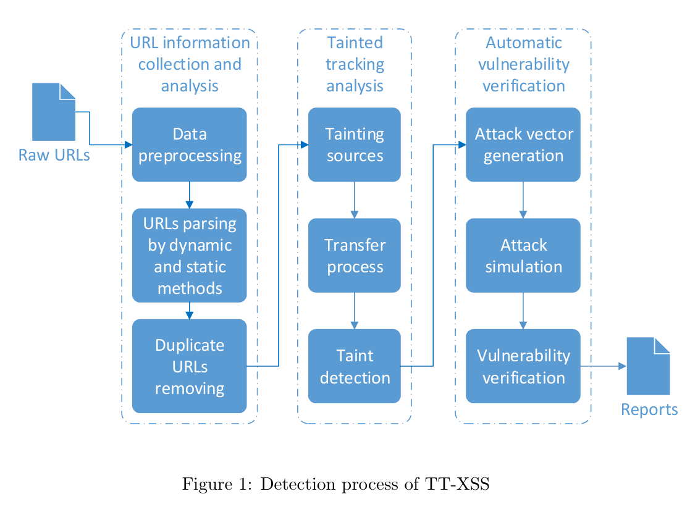
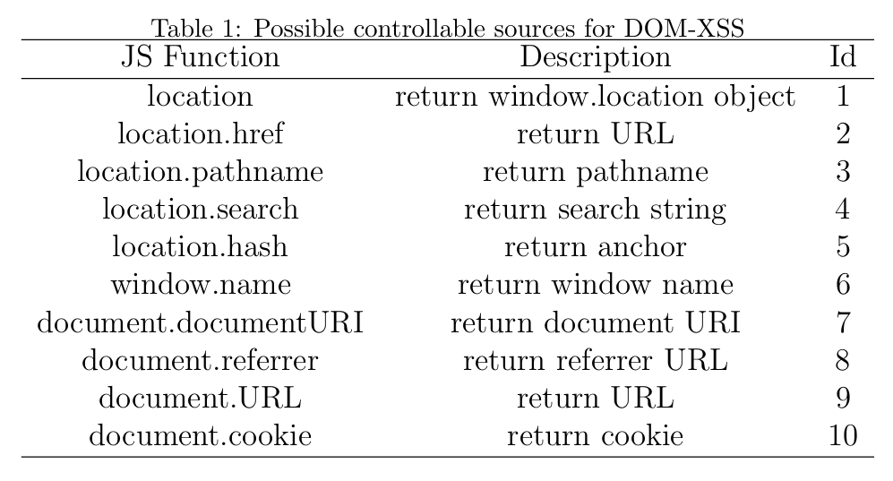
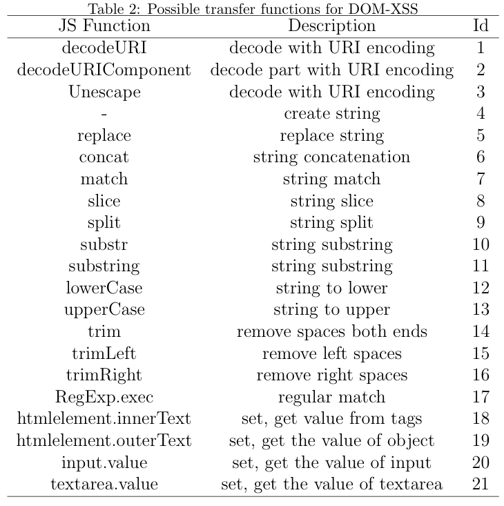
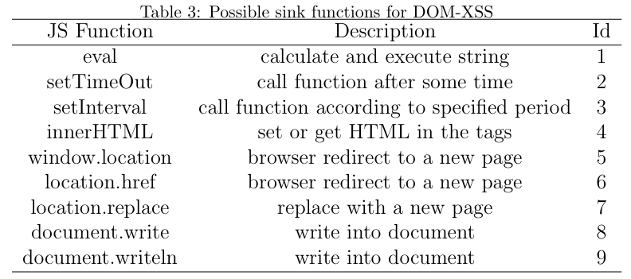

<div style="text-align: justify;">

# TT-XSS: A Novel Taint-Tracking Dynamic Detection Framework for DOM XSS

- **Authors:** Ran Wang, Guangquan Xu, Xianjiao Zeng, Xiaohong Li, Zhiyong Feng
- **DOI / Link:** https://doi.org/10.1016/j.jpdc.2017.07.006

## How I prepare these notes and how to read them
I first record unfamiliar terminology to reference later. Then I summarize each section and provide clear explanations of the methodology and other key parts of the paper. If you are already familiar with the terminology, you can skip the "Terminology Notes" section and start at "Paper Notes".

## Contents

- [Terminology Notes](#terminology-notes)
    - [What is DOM-Based XSS?](#1-what-is-dom-based-xss)
    - [What is Taint Tracking detection?](#2-what-is-taint-tracking-detection)
    - [Why the term Dynamic?](#3-why-the-term-dynamic)
    - [What is Obfuscated code?](#4-what-is-obfuscated-code)
- [Paper Notes](#paper-notes)
    - [Abstract (Summary)](#0-absract-summery)
    - [Introduction (Summary)](#1-introduction-summary)
    - [Related Work](#2-related-work)
    - [Detection framework for DOM-XSS](#3-detection-framework-for-dom-xss)
        - [URL Information Collection and Analysis Module](#31-url-information-collection-and-analysis-module)
        - [Taint tracking analysis](#32-taint-tracking-analysis)
            - [Analysis of related DOM APIs](#321-analysis-of-related-dom-apis)


# Terminology Notes

## 1. What is DOM-Based XSS?
See: [DOM-Based XSS](https://github.com/mahinsarker420/Cybersecurity-Notes/blob/75d2c5872991ef71b63553e1e838653db61af712/Cross-Site%20Scripting%20(XSS)/DOM-Based-XSS.md)

## 2. What is Taint Tracking detection?
Taint Tracking Based Dynamic Detection is a runtime security technique used to detect whether untrusted input (called tainted data) reaches sensitive parts of a program in a dangerous way. Think of it like placing invisible colored ink on user-controlled data and then watching where that ink spreads through the application while it runs.

### Example:

Suppose a website has a login form.
```
User input:
username = ' OR 1=1 --

↓ (mark as tainted)

Application processes data

↓

SQL Query:
SELECT * FROM users WHERE username=' ' OR 1=1 -- '

↓

Sensitive sink reached
(Database query execution)

↓

Alert: Possible SQL Injection
```

The flow works like this:
```
Source → Propagation → Sink → Detection
```
- Source = where external data enters the application (User input, URL parameters, Cookies, Network packets, File input)
- Propagation = how the data moves inside the program (Assignments, Variables, Function calls, String operations)
Sink = dangerous operations (SQL execution, System command execution, HTML rendering, File access)

If tainted data reaches a sensitive sink without proper sanitization, the system raises a warning.

### Example with XSS:
```JavaScript
var input = location.hash;      // Source (tainted)
document.innerHTML = input;     // Sink
```
Tracking process:
```
location.hash
      ↓
marked tainted
      ↓
stored in variable input
      ↓
passed into innerHTML
      ↓
possible XSS detected
```
## 3. Why the term Dynamic?
Because the monitoring happens while the program is actually executing, not by only reading source code.

### Limitations:
- Performance overhead can be high because every data movement may be tracked
- Only sees executed code paths
- Complex applications may create taint explosion (too many tracked variables)
- Attackers sometimes bypass simplistic taint rules

## 4. What is Obfuscated code?
Obfuscated code is code that has been intentionally modified to make it difficult for humans (and sometimes security tools) to understand, while still keeping the same functionality. Developers may use it to protect intellectual property, but attackers also use it to hide malicious behavior.

### Simple example:

Normal JavaScript:
```JavaScript
alert("Hello");
```
Obfuscated version:
```JavaScript
eval(String.fromCharCode(97,108,101,114,116,40,34,72,101,108,108,111,34,41))
```
What happens:
```
97 → a
108 → l
101 → e
114 → r
116 → t
```
After conversion, it becomes:
```JavaScript
alert("Hello")
```
Another XSS-related example:

Normal code:
```JavaScript
document.write("<script>alert('XSS')</script>");
```
Obfuscated code:
```JavaScript
document.write("\x3Cscript\x3Ealert('XSS')\x3C/script\x3E");
```
Here:
```
\x3C = <
\x3E = >
```
So the browser still executes:
```JavaScript
<script>alert('XSS')</script>
```
This is why obfuscated code creates problems for static analysis tools: the tool may struggle to understand the real behavior because the code is hidden or transformed.


# Paper Notes:

## 0 Absract (Summery):

DOM-Based XSS detection method can be divided into three types : black-box fuzzing, static analysis, and dynamic analysis.
- **Black-box fuzzing**: A testing method where random, malformed, or unexpected inputs are sent to an application without knowing its internal code, to discover crashes or vulnerabilities.
- **Static analysis**: A technique that examines source code or program files without running the application, looking for coding errors and potential security weaknesses.
- **Dynamic analysis**: A method that analyzes an application while it is actually running, monitoring its behavior and data flow to detect vulnerabilities during execution.

Black-box fuzzing and static analysis have problems because fuzzing can miss many vulnerabilities (high false negatives), while static analysis may incorrectly report safe code as vulnerable (high false positives). Dynamic analysis usually gives better results because it analyzes the application while it is running, but it is often difficult and expensive to implement. To solve these issues, the authors created a new framework called TT-XSS that uses taint tracking on the client side (inside the browser). Their system modifies JavaScript features and browser DOM APIs so it can track how untrusted data moves through the web page. It marks input sources, follows how the data is transferred, and checks whether it reaches dangerous places (sinks). Using this information, the framework can automatically create attack inputs to verify whether a real vulnerability exists. When compared with another security tool, AWVS 10.0, their framework found 1.8% more vulnerabilities and automatically generated attack payloads for 9.1% of vulnerabilities.

## 1 Introduction (Summary):
This paragraph explains that Cross-Site Scripting (XSS) is one of the major security problems in
modern web applications because it can cause serious issues such as stealing user information, violating privacy, and even spreading malicious worms. XSS is considered an important security risk and is often listed among the top web security threats. XSS vulnerabilities are generally divided into three types: Reflected XSS, Stored XSS, and DOM-XSS. **DOM-XSS is different from the other two because its attack process happens inside the browser using JavaScript and the Document Object Model (DOM), so methods used for detecting Reflected and Stored XSS do not work well for it**. As web applications continue to grow and use more client-side JavaScript, DOM-XSS attacks are becoming more common, creating a need for better detection methods. Existing approaches mainly use black-box fuzzing and static analysis, but both have limitations: fuzzing may miss vulnerabilities because it cannot test every possible case, while static analysis struggles with problems like unclear code structure and obfuscated code. Dynamic analysis gives more accurate results but is difficult and expensive to implement. To solve this issue, the authors propose a new dynamic detection framework based on taint tracking, where they introduce new data types and methods to track data flow in the browser, automatically generate attack payloads to verify vulnerabilities, and build a prototype by modifying browser components such as JavaScriptCore and WebKit. The rest of the paper explains related work, the framework design, implementation details, experimental results, and future work.

## 2 Related Work:
This section explains previous research related to DOM-XSS detection. As modern web applications have evolved, many functions that were previously handled by servers are now processed on the client side using JavaScript. With the growth of JavaScript and support for HTML5 features in browsers, web applications have become more powerful but also introduced more security risks. DOM-XSS is a purely client-side vulnerability that happens inside the browser during DOM processing and does not require direct server involvement. Detecting DOM-XSS is challenging because client-side code runs on users’ devices rather than under server control, JavaScript can dynamically execute strings as code using functions like eval(), and many applications use third-party JavaScript code that developers cannot fully monitor. The paragraph also reviews earlier research and tools. Some methods used static analysis, black-box fuzzing, or taint tracking to detect XSS, but each had limitations. Some tools focused on tracking sensitive information instead of malicious input, some required manual testing, and others could not automatically verify vulnerabilities. The authors explain that black-box testing often misses vulnerabilities because it cannot test every possible attack input, while static analysis may generate many false positives in complex situations. Therefore, the paper proposes using dynamic taint tracking because it can follow the actual flow of untrusted data during program execution and improve the detection and verification of DOM-XSS vulnerabilities.

## 3 Detection framework for DOM-XSS
TT-XSS dynamic DOM-XSS detection framework is mainly composed of three modules: URL information collection and analysis, taint tracking analysis and automatic vulnerability verification.



### Understandable process flow of TT-XSS Detection:
```
Raw URLs
    ↓
Input into Framework
    ↓
Preprocessing
    ↓
Dynamic + Static Parsing
    ↓
Taint Tracking Analysis
    ↓
Obtain Taint Traces
    ↓
Analyze data flow inside web pages
    ↓
Automatic Vulnerability Verification
    ↓
Generate Vulnerability Report
```

### 3.1 URL Information Collection and Analysis Module 
This module functions as an intelligent web crawler that systematically discovers and processes web pages. Let me break down how it works:

#### 1. URL Queue System
- Starts with a queue (waiting list) containing the initial input URLs
- Continuously processes URLs from this queue
- As new URLs are discovered, they're added back to the queue
- Continues until the queue is empty (all URLs processed)

#### 2. Browser-Based Processing
When processing each URL, a browser:
- Parses the URL structure
- Renders the actual webpage (loads it visually)
- Gathers information from the rendered page
- Extracts new URLs found on that page

#### Two Key Features
**Feature 1:** Dual Parsing Methods

**Static Parsing:**
- Analyzes only the raw HTTP response (the initial server response)
- Extracts URLs directly visible in the HTML code
- Fast but limited - misses dynamically loaded content

**Dynamic Parsing:**
- Actually renders the webpage in a browser
- Waits for JavaScript to execute
- Captures URLs that appear after page interactions
- More comprehensive - finds URLs loaded via AJAX, JavaScript events, etc.

**Feature 2:** Duplicate Removal
The system prevents processing the same URL multiple times using two comparison methods:
- URL Comparison - Checks if the exact URL was already visited
- Script Comparison - Checks if pages have identical JavaScript code (might indicate same functionality despite different URLs)

**Bloom Filter Technology:**
- A space-efficient probabilistic data structure
- Quickly checks "Have we seen this URL before?" without storing every URL
- Very fast and memory-efficient for large-scale crawling

#### Why This Design Matters
- Comprehensive coverage - Finds both static and dynamic URLs
- mEfficiency - Avoids processing duplicates
- Thoroughness - Discovers the complete web structure, including hidden/JavaScript-loaded pages
- Scalability - Bloom Filter handles millions of URLs efficiently

### 3.2 Taint tracking analysis
Think of taint tracking like putting a colored dye in water to trace where it flows through a pipe system. Here, we're tracking how user input flows through a website to find security vulnerabilities.
#### What Problem Does This Solve?
DOM-XSS (Cross-Site Scripting) attacks happen when malicious code runs entirely inside your browser. Imagine someone injecting harmful code through a search box, and that code executes without the website even realizing it. This method catches those vulnerabilities.
#### How It Works?? 
When you type something into a website (like a search query or form), this system "tags" that input with a special marker, like putting a tracking chip on it. Then it watches where that tagged data goes and what happens to it.
**Example:**
- You type `<script>alert('hacked')</script>` in a search box
- The system tags this input: "This came from a user"
- It follows this tagged data as it moves through the website's code
- If the tagged data ends up somewhere dangerous (like being executed as code), it raises an alert

#### The Four Steps (Explained Simply)
**Step 1:** Make a List of Risky Functions
They identify all the dangerous "doors" where user input could cause trouble. These are called DOM APIs - basically, the functions websites use to manipulate web pages.
Examples of risky functions:
- `innerHTML` - inserts content into a page
- `document.write` - writes directly to the page
- `eval()` - executes code from text

Each one gets a number, like creating an index of "potential danger zones."

**Step 2**: Design the Tagging System
They figure out:
- How to tag the data - like putting a virtual sticker saying "User Input - Handle With Care"
- How tags transfer - if tagged data gets copied or modified, the tag follows it
- Where to store the tags - keeping a record of what's tagged and where it's going

Think of it like a package delivery system tracking a parcel through every checkpoint.

**Step 3:** Modify the Browser Engine
This is the technical heavy-lifting. They actually change how the browser works (specifically JavaScriptCore and WebKit engines) so that:
- Every risky function is modified to recognize and pass along tags
- When user input flows through these functions, the tags stay attached
- The system can see the complete journey of the data

**Analogy:** It's like installing cameras at every intersection in a city to track where a specific car goes.

**Step 4:** Analyze the Results
Once data flows are tracked, they examine:
- Which user inputs reached dangerous destinations?
- Did any input get executed as code?
- Where are the vulnerabilities?

This creates a taint trace - a complete map showing "User typed X → it went through functions A, B, C → it ended up being executed as code in location Z."

#### Special Advantages
**Works in Real-Time**

This isn't analyzing code on paper - it runs while you're actually browsing, catching issues as they happen.

**Beats Code Obfuscation**

Some hackers scramble their code to hide what it does. This method doesn't care because it watches what the code actually does in your browser, not what it looks like on paper.
Example: Even if malicious code looks like gibberish:
```javascript
var _0x4df=['alert','hacked'];eval(_0x4df[0]+'("'+_0x4df[1]+'")');
```
The system sees it's still using eval() and tracks it.

**Works With Third-Party Libraries**

Websites often use popular libraries like jQuery. The tracking still works accurately because it monitors the browser's underlying functions, not the high-level library code.

#### Real-World Example
**Vulnerable Website:**
```javascript
// User searches for something
var userSearch = getInputFromSearchBox(); 
document.getElementById('results').innerHTML = "You searched for: " + userSearch;
```
**What Taint Tracking Sees:**
- Tag: userSearch is marked as "user-controlled"
- Track: Tagged data flows into innerHTML
- Alert: "User input is being inserted directly into HTML - XSS vulnerability detected!"

The Fix: Sanitize the input first before displaying it.

#### Bottom Line
This method is like having a security guard with a tracking device who:
- Tags anything that comes from users
- Follows it everywhere through the website
- Sounds an alarm if it reaches somewhere it could cause harm

### 3.2.1 Analysis of related DOM APIs
Think of a DOM-XSS attack like water flowing through a house's plumbing. To prevent flooding (attacks), you need to monitor three things:
- Where water enters (Sources)
- How it travels through pipes (Transfer Functions)
- Where it comes out (Sinks)

If you miss monitoring even one pipe, you'll lose track of the water and miss potential leaks.

#### **Part 1:** Controllable Sources (Where Attacks Enter)\


These are the **entry points** hackers can manipulate to inject malicious code.

**What Are They?**<br>
Controllable sources are parts of a website that users can directly influence, like:
- The URL in your browser's address bar
- Cookies stored on your computer
- The name of your browser window

**The Main Categories:**

Location-Based Sources (Most Common) These come from the URL itself:


| Source                | What It Is            | Example                                 |
| --------------------  | -----------------     | ------------------                      |
| `location.href`       | The complete URL      | `https://example.com/search?q=hello#top`|
| `location.pathname`   | The page path         | `/search`                               |
| `location.search`     | Query parameters      | `?q=hello`                              |
| `location.hash`       | The anchor/fragment   | `#top`                                  |

Real Attack Example:
```
https://vulnerable-site.com/search?q=<script>alert('hacked')</script>
```
The `location.search` contains malicious code that could be executed.

**Document-Based Sources**
| Source                | What It Does            |
| --------------------  | -----------------     |
|`document.referrer`  | Where you came from (previous page)| 
|`document.cookie`    | Stored cookies                     |
|`document.URL`       | Current page URL                   |

**Attack Scenario:** A hacker creates a malicious website that redirects you to a vulnerable site. The `document.referrer` now contains the hacker's injected code.

**Window-Based Sources**
| Source                | What It is            |
| --------------------  | -----------------     |
|`window.name`  | A storage area that persists across page loads| 

**Why It's Dangerous:** Hackers can set `window.name` to malicious code, and even when you navigate to a new page, that value stays in your browser.

#### Part 2: Transfer Functions (How Data Transforms)


Once malicious data enters, it often gets modified as it flows through the code. These are the "pipes" that change the data but must keep the tracking tag attached.

**Why This Matters:**

If you tag input as "dangerous" but it gets decoded, sliced, or concatenated, you need to ensure the tag follows the modified data.

**Types of Transfer Functions:**

**Decoding Functions** (Unwrap Hidden Code)
```javascript
decodeURI("%3Cscript%3Ealert('xss')%3C/script%3E")
// Becomes: <script>alert('xss')</script>
```
Hackers encode malicious scripts to bypass filters. These functions decode them back.

**String Manipulation**
```javascript
var input = "<script>alert('xss')</script>";
var partial = input.slice(0, 8); // "<script>"
```
Even a piece of the malicious code is still dangerous!

**Concatenation** (Joining Strings)
```javascript
var part1 = "<scr";
var part2 = "ipt>alert(1)</script>";
var dangerous = part1 + part2; // Full attack code assembled
```
Tags must follow through joins so you know the complete string is tainted.

**Pattern Matching & Replacement**
```javascript
var input = "HELLO<script>alert(1)</script>";
var cleaned = input.replace("HELLO", ""); 
// Still contains: <script>alert(1)</script>
```

Even after replacement, the dangerous part remains.

**Getting/Setting Values**
```javascript
document.getElementById('search').value = userInput;
```
If userInput is tagged as dangerous, the tag must transfer to the element's value.

#### Part 3: Sink Functions (Where Attacks Execute)

These are the danger zones - functions that can actually execute code or modify the page in harmful ways.

**Why They're Called "Sinks":**

This is where the "tainted water" finally flows out and causes damage.

**Types of Dangerous Sinks:**

**Code Execution (MOST DANGEROUS)**
| Function              | What It Does          | Danger Level                            |
| --------------------  | -----------------     | ------------------                      |
|eval()         | Executes any string as JavaScript code  | 🔴 Critical|
|setTimeout()   | Runs code after a delay                 | 🔴 Critical|
|setInterval()  | Runs code repeatedly                    | 🔴 Critical|


Example:
```javascript
var userInput = location.search; // "?code=alert('hacked')"
eval(userInput); // EXECUTES THE ATTACK!
```
**Page Redirection**
| Function              | What It Does          |
| --------------------  | -----------------     | 
|`window.location`       | Redirects to a new URL|
|`location.href`          | Changes the current page|
|`location.replace()`     | Replaces the current page|

**Attack:**
```javascript
location.href = "javascript:alert('xss')"; // Executes code!
```
**DOM Modification**
| Function              | What It Does          |
| --------------------  | -----------------     | 
|innerHTML              | Inserts HTML (including scripts)|
|document.write()       | Writes directly to the document|

**Example:**
```javascript
document.getElementById('result').innerHTML = userInput;
// If userInput = "", attack executes!
```

#### Putting It All Together: A Complete Attack Path
**Step-by-Step Attack Flow:**
```javascript
// 1. SOURCE: Attacker crafts malicious URL
// URL: example.com/page?search=<script>alert('hacked')</script>

// 2. TRANSFER: Website processes the input
var userSearch = location.search;           // Source (tagged)
userSearch = decodeURI(userSearch);         // Transfer (tag follows)
userSearch = userSearch.replace("?search=", ""); // Transfer (tag follows)

// 3. SINK: Website displays the "search" result
document.getElementById('output').innerHTML = userSearch; // SINK - ATTACK!
```
**What Taint Tracking Sees:**
- Tag applied at: `location.search`
- Tag transferred through: `decodeURI → replace`
- Tag reached dangerous sink: `innerHTML`
- ALERT: `DOM-XSS Vulnerability Detected!`

#### Why All Three Must Be Tracked
**Missing Source Tracking:** You won't know malicious data entered the system.
**Missing Transfer Tracking:** You lose track of the data as it transforms.
**Missing Sink Tracking:** You won't know when/where the attack executes.
**The Complete System:**By numbering and modifying ALL these functions (Tables 1, 2, and 3), the system creates an unbreakable tracking chain from the moment data enters to when it potentially causes harm.

</div>
